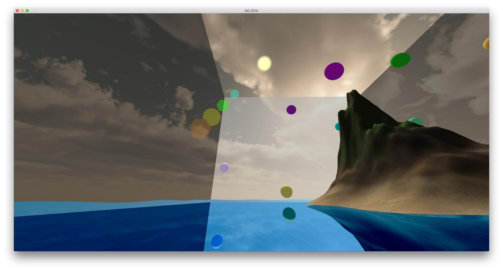

**Computational Graphics project (BSc) - OpenGL**

Authors: [ABaptista](https://github.com/ABaptista) and [davidgomes](https://github.com/davidgomes)

**Features:**
* Object and texture loader
* Object and texture rendering
* Skybox
* Sea shader
* Sun shader
* Lens flare shader
* Collisions
* Particles



How to compile (Linux and OSX):

```
  cmake .
  make
  ./cg2015
```
